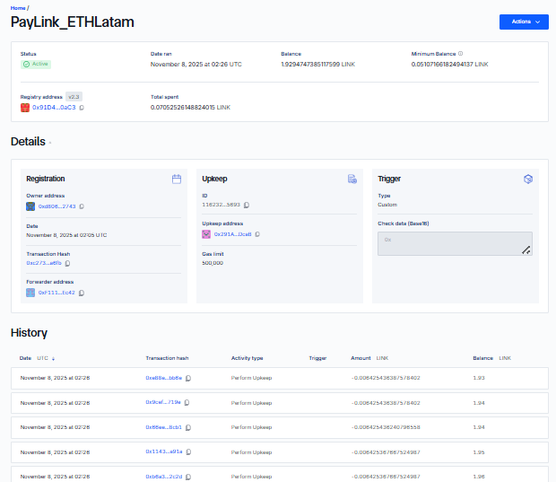
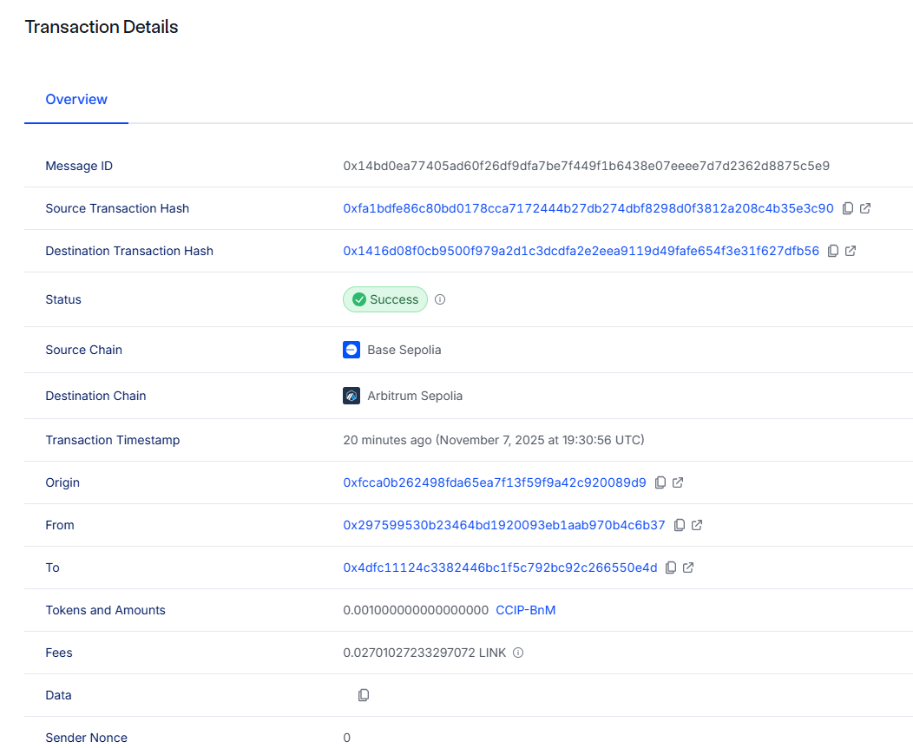
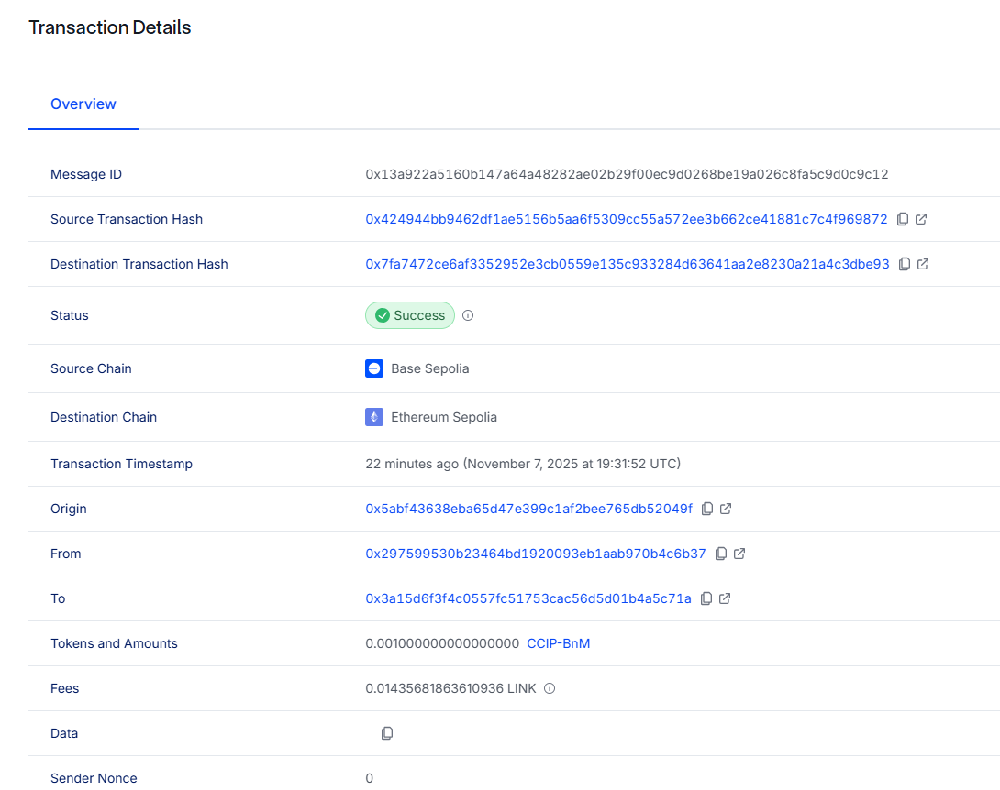

# LinkPay – Automated Cross-Chain Payroll System

> **Native USDC cross-chain payments powered by Wormhole CCTP and Chainlink**

**dApp:** [https://linkpay-seven.vercel.app/](https://linkpay-seven.vercel.app/)

**Smart Contracts:**
- Chainlink CCIP Version: [0x291AB221FB0E8C8EEE246E9476Bb2E892D82DcaB](https://sepolia.basescan.org/address/0x291AB221FB0E8C8EEE246E9476Bb2E892D82DcaB#code) (Base Sepolia)
- **Wormhole CCTP Version**: [0x4F295724B7C1BD45699Ca29939C5C99a937947a6](https://sepolia.basescan.org/address/0x4F295724B7C1BD45699Ca29939C5C99a937947a6#code) (Base Sepolia)

**Slides / Presentation:** [https://gamma.app/docs/LinkPay-Secure-Payments-on-the-Blockchain-8ofb4o7ffjy3wmr?mode=doc](https://gamma.app/docs/LinkPay-Secure-Payments-on-the-Blockchain-8ofb4o7ffjy3wmr?mode=doc)

---

## 🚀 Quick Start

### Installation with Makefile

```bash
# Clone the repository
git clone https://github.com/fabriciojallaza/LinkPay
cd LinkPay

# Install all dependencies (contracts + frontend)
make install

# Build everything
make build

# Or run complete setup
make setup
```

### Manual Installation

```bash
# Install contract dependencies
cd contracts
forge install OpenZeppelin/openzeppelin-contracts --no-git
forge install foundry-rs/forge-std --no-git
forge build

# Install frontend dependencies
cd ../frontend/frontend
npm install
npm run dev
```

### Deploy Contracts

```bash
# Create .env file in contracts/
cd contracts
cp .env.example .env
# Add your PRIVATE_KEY, BASE_SEPOLIA_RPC_URL, BASESCAN_API_KEY

# Deploy LinkPayWormhole to Base Sepolia
make deploy-sepolia

# Or from root:
make deploy-contracts
```

### Available Make Commands

```bash
make help              # Show all available commands
make install           # Install all dependencies
make build             # Build contracts and frontend
make test-contracts    # Run contract tests
make deploy-contracts  # Deploy to Base Sepolia
make frontend-dev      # Start frontend dev server
make clean             # Clean build artifacts
make info              # Show project info
```

---

## 🌐 Project Overview

**LinkPay** is a decentralized, automated payroll platform that enables companies to pay employees in **USDC** across multiple blockchain networks, using **Chainlink services** for automation and cross-chain interoperability.

Traditional payroll systems are often **slow, expensive, and require manual processing**. LinkPay solves this by combining **Chainlink Automation** and **Chainlink CCIP** to create a **borderless, transparent, and self-operating payroll solution**.

### LinkPay platform

---

## ⚙️ How It Works

1. **Company Registration:**

   * A company pays **0.01 CCIP-BnM** to be registered.
   * After registration, it can add employees with their **salary** and **destination chain**.
   * This registration fee generates revenue for LinkPay.

2. **Automated Payroll Execution:**

   * **Chainlink Automation** periodically calls the `performUpkeep` function to execute payroll payments automatically.

3. **Cross-Chain Payments:**

   * **Chainlink CCIP** transfers USDC across different blockchains directly to each employee’s wallet.

4. **On-Chain State Updates:**

   * Each transaction updates the state on-chain — transferring funds, updating balances, and recording completed payments.

**Important for Testing:**
For tests, the **CCIP-BnM token** can be routed through Chainlink and bridged across different testnet chains. Fund your wallet with test tokens from:
[https://docs.chain.link/ccip/test-tokens#evm-chains](https://docs.chain.link/ccip/test-tokens#evm-chains)

**Note:** On mainnet, **CCIP-BnM** is replaced with **USDC** for actual payments.

### Flow Diagram


---

## 🚀 Key Features

* **Company Management:** Register, update, and manage companies
* **Employee Management:** Add employees with wallet, salary, and destination blockchain
* **Automated Payments:** Scheduled salary payments using Chainlink Automation
* **Cross-Chain Interoperability:** Secure transfers via Chainlink CCIP
* **Real-Time Price Feeds:** Track token values with Chainlink oracles
* **Payment History:** Transparent record of all payroll transactions
* **Wallet Integration:** MetaMask connection with network auto-switch

---

## 🛠️ Tech Stack

* **Smart Contracts:** Solidity
* **Frontend:** Next.js 16 + React 19, TypeScript, Tailwind CSS 4
* **Blockchain Interaction:** Ethers.js v5
* **UI & Components:** Radix UI, Lucide React, React Hook Form, Sonner, Recharts
* **Oracles & Automation:** Chainlink Automation, Chainlink CCIP, Chainlink Price Feeds

---

## 📂 Project Structure

```
LinkPay/
├── contracts/        # Smart contracts
├── frontend/         # React/Next.js frontend
│   ├── components/   # React components
│   ├── util/         # Contract interaction helpers
│   ├── styles/       # Tailwind and global styles
│   └── app/          # Main Next.js app
├── scripts/          # Deployment and testing scripts
└── README.md         # This general README
```

---

## 💡 Usage Guide

### Company Registration

1. Connect MetaMask wallet
2. Pay **0.01 CCIP-BnM** for registration
3. Add employees (name, wallet, destination chain, salary)

### Automated Payments

* Chainlink Automation triggers payroll automatically
* Cross-chain salaries sent via Chainlink CCIP

### Payment History

* Track all completed and scheduled payments
* Transparent on-chain record with transaction hashes

---

## 🌐 Supported Networks

| Selector | Network          |
| -------- | ---------------- |
| 0        | Base             |
| 1        | Arbitrum         |
| 2        | Avalanche        |
| 3        | Ethereum Sepolia |

---

## 🎁 Sponsors / Integrations

| Sponsor   | Service / Feature                                                           | File / Line Reference                                  |
| --------- | --------------------------------------------------------------------------- | ------------------------------------------------------ |
| Chainlink | Automation – triggers scheduled payments                                    | `/contracts/LinkPay.sol` – Lines 336 & 387             |
| Chainlink | CCIP (Cross-Chain Interoperability Protocol) – secure cross-chain transfers | `/contracts/LinkPay.sol` – Lines 443–610               |
| Chainlink | Price Feeds – Real-time token conversion rates                              | `frontend/components/ui/price-feed.tsx` – Lines 60–196 |

---

## 📄 License

This project is part of the LinkPay system. See main repository for license details.

---

## 📧 Support

Open an issue in the GitHub repository or contact the development team for assistance.

---

**Built with ❤️ for decentralized, cross-chain payroll management.**

## 🖼️ Screenshots

### Chainlink Automation


### Payment in Base


### Payment in Arbitrum


### Payment in Avalanche


### Payment in Ethereum

