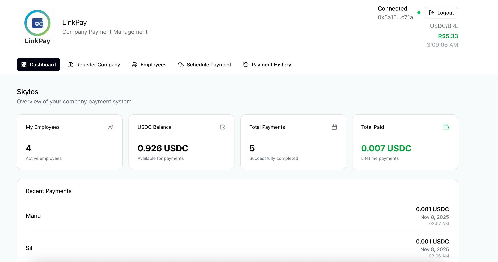
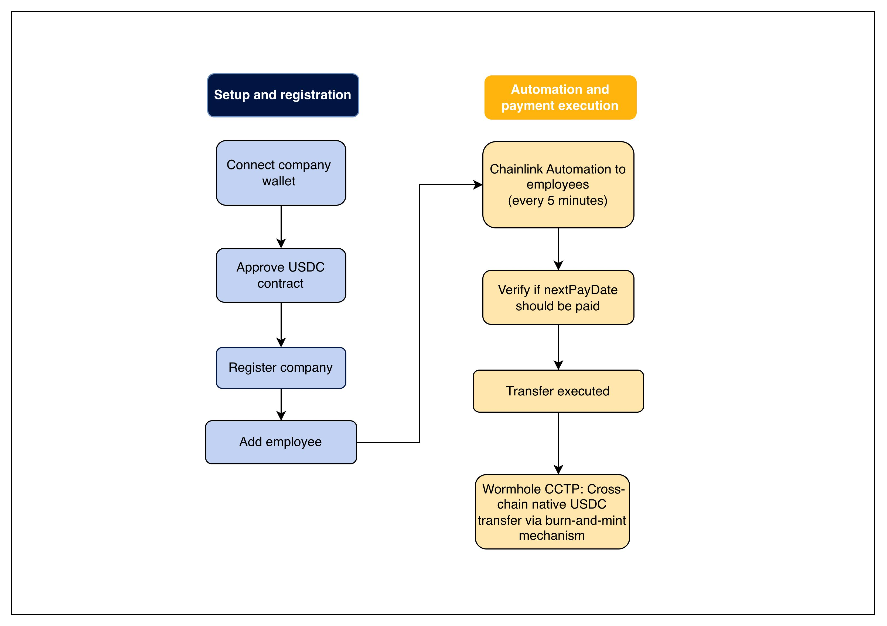

# LinkPay – Automated Cross-Chain Payroll System

> **Native USDC cross-chain payments powered by Wormhole CCTP and Chainlink**

**dApp:** [https://linkpay-seven.vercel.app/](https://linkpay-seven.vercel.app/)

**Smart Contracts:**
- Chainlink CCIP Version: [0x291AB221FB0E8C8EEE246E9476Bb2E892D82DcaB](https://sepolia.basescan.org/address/0x291AB221FB0E8C8EEE246E9476Bb2E892D82DcaB#code) (Base Sepolia)
- **Wormhole CCTP Version**: [0xe7335Ee6af0bE5288daeC898Cf74D51D3eE92A2e](https://sepolia.basescan.org/address/0xe7335Ee6af0bE5288daeC898Cf74D51D3eE92A2e#code) (Base Sepolia)

**Slides / Presentation:** [https://gamma.app/docs/Copy-of-LinkPay-Secure-Payments-on-the-Blockchain-bps6l3xgoqlt8f8](https://gamma.app/docs/LinkPay-Secure-Payments-on-the-Blockchain-8ofb4o7ffjy3wmr?mode=doc)

---

## 🚀 Quick Start

### Installation with Makefile

```bash
# Clone the repository
git clone https://github.com/fabriciojallaza/LinkPay
cd LinkPay

# Install all dependencies (contracts + frontend)
make install

# Build everything
make build

# Or run complete setup
make setup
```

### Manual Installation

```bash
# Install contract dependencies
cd contracts
forge install OpenZeppelin/openzeppelin-contracts --no-git
forge install foundry-rs/forge-std --no-git
forge build

# Install frontend dependencies
cd ../frontend/frontend
npm install
npm run dev
```

### Deploy Contracts

```bash
# Create .env file in contracts/
cd contracts
cp .env.example .env
# Add your PRIVATE_KEY, BASE_SEPOLIA_RPC_URL, BASESCAN_API_KEY

# Deploy LinkPayWormhole to Base Sepolia
make deploy-sepolia

# Or from root:
make deploy-contracts
```

### Available Make Commands

```bash
make help              # Show all available commands
make install           # Install all dependencies
make build             # Build contracts and frontend
make test-contracts    # Run contract tests
make deploy-contracts  # Deploy to Base Sepolia
make frontend-dev      # Start frontend dev server
make clean             # Clean build artifacts
make info              # Show project info
```

---

## 🌐 Project Overview

**LinkPay** is a decentralized, automated payroll platform that enables companies to pay employees in **native USDC** across multiple blockchain networks, using **Wormhole CCTP** for cross-chain transfers and **Chainlink Automation** for scheduled execution.

Traditional payroll systems are often **slow, expensive, and require manual processing**. LinkPay solves this by combining **Wormhole's burn-and-mint USDC transfers** and **Chainlink Automation** to create a **borderless, transparent, and self-operating payroll solution** with no wrapped tokens.

### LinkPay platform

---

## ⚙️ How It Works

1. **Company Registration:**

   * A company registers with a small USDC fee (currently set to 0 for testing).
   * After registration, it can add employees with their **salary** and **destination chain** (using Wormhole chain IDs).

2. **Automated Payroll Execution:**

   * **Chainlink Automation** periodically calls the `performUpkeep` function to execute payroll payments automatically.
   * Payments are processed every 5 minutes (configurable interval).

3. **Cross-Chain Payments via Wormhole CCTP:**

   * **Same-chain payments** (e.g., Base → Base): Direct USDC transfer
   * **Cross-chain payments**: Wormhole CCTP burns USDC on source chain, mints native USDC on destination chain
   * No wrapped tokens – employees receive real, native USDC
   * Automated relaying – no manual redemption needed

4. **On-Chain State Updates:**

   * Each transaction updates the state on-chain — transferring funds, updating balances, and recording completed payments.

**Supported Networks (Wormhole Chain IDs):**
- Base Sepolia: 10004
- Arbitrum Sepolia: 10003
- Avalanche Fuji: 6
- Optimism Sepolia: 10005
- Ethereum Sepolia: 10002

### Flow Diagram


---

## 🚀 Key Features

* **Company Management:** Register, update, and manage companies
* **Employee Management:** Add employees with wallet, salary, and destination blockchain
* **Automated Payments:** Scheduled salary payments using Chainlink Automation (5-minute intervals)
* **Cross-Chain Native USDC:** Secure transfers via Wormhole CCTP (burn-and-mint mechanism)
* **No Wrapped Tokens:** Employees receive real, native USDC on their destination chain
* **Multi-Chain Support:** Base, Arbitrum, Avalanche, Optimism, and Ethereum Sepolia testnets
* **Payment History:** Transparent record of all payroll transactions
* **Wallet Integration:** MetaMask connection with network auto-switch

---

## 🛠️ Tech Stack

* **Smart Contracts:** Solidity 0.8.17
* **Frontend:** Next.js 16 + React 19, TypeScript, Tailwind CSS 4
* **Blockchain Interaction:** Ethers.js v5
* **UI & Components:** Radix UI, Lucide React, React Hook Form, Sonner, Recharts
* **Cross-Chain Protocol:** Wormhole CCTP (Circle's Cross-Chain Transfer Protocol)
* **Automation:** Chainlink Automation
* **Development Tools:** Foundry (Forge, Cast, Anvil)

---

## 📂 Project Structure

```
LinkPay/
├── contracts/        # Smart contracts
├── frontend/         # React/Next.js frontend
│   ├── components/   # React components
│   ├── util/         # Contract interaction helpers
│   ├── styles/       # Tailwind and global styles
│   └── app/          # Main Next.js app
├── scripts/          # Deployment and testing scripts
└── README.md         # This general README
```

---

## 💡 Usage Guide

### Company Registration

1. Connect MetaMask wallet to Base Sepolia
2. Register company (free for testing)
3. Add employees (name, wallet, Wormhole chain ID, salary in USDC)

### Automated Payments

* **Chainlink Automation** triggers payroll every 5 minutes automatically
* **Same-chain payments** (Base → Base): Direct USDC transfer
* **Cross-chain payments**: Wormhole CCTP burns and mints native USDC on destination chain
* Requires 0.01 ETH per cross-chain payment for Wormhole relayer fees

### Payment History

* Track all completed and scheduled payments
* Transparent on-chain record with transaction hashes
* Monitor cross-chain transfers on [WormholeScan](https://wormholescan.io)

---

## 🌐 Supported Networks

| Wormhole Chain ID | Network          | Network ID | CCTP Support |
|-------------------|------------------|------------|--------------|
| 10004             | Base Sepolia     | 84532      | ✅            |
| 10003             | Arbitrum Sepolia | 421614     | ✅            |
| 6                 | Avalanche Fuji   | 43113      | ✅            |
| 10005             | Optimism Sepolia | 11155420   | ✅            |
| 10002             | Ethereum Sepolia | 11155111   | ✅            |

---

## 🎁 Sponsors / Integrations

| Sponsor   | Service / Feature                                                     | File / Line Reference                                           |
| --------- | --------------------------------------------------------------------- | --------------------------------------------------------------- |
| Wormhole  | CCTP – Native USDC cross-chain transfers (burn-and-mint)             | `/contracts/src/LinkPayWormhole.sol` – Lines 526-582            |
| Chainlink | Automation – Triggers scheduled payments automatically                | `/contracts/src/LinkPayWormhole.sol` – Lines 336-387            |
| Chainlink | Price Feeds – Real-time token conversion rates (frontend)             | `frontend/components/ui/price-feed.tsx` – Lines 60–196          |

### Additional Documentation

- **Wormhole Integration Guide**: See [WORMHOLE_INTEGRATION.md](./WORMHOLE_INTEGRATION.md) for complete Wormhole CCTP setup and usage

---

## 📄 License

This project is part of the LinkPay system. See main repository for license details.

---

## 📧 Support

Open an issue in the GitHub repository or contact the development team for assistance.

---

**Built with ❤️ for decentralized, cross-chain payroll management.**
