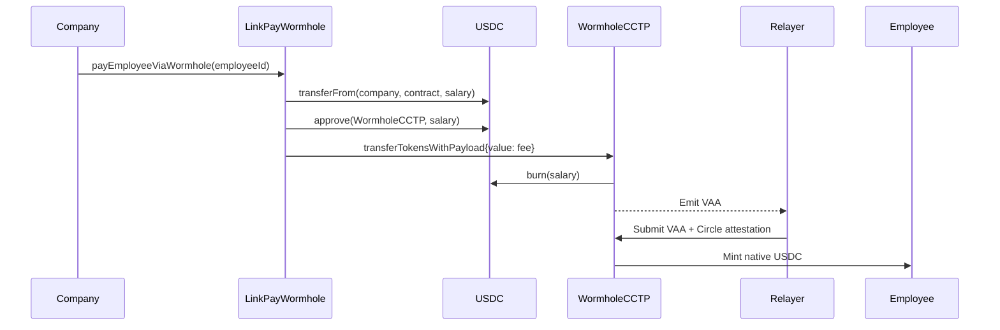

# 🪱 LinkPay + Wormhole CCTP Integration

> **Automated cross-chain payroll with native USDC transfers powered by Wormhole**

## Overview

LinkPay has been enhanced with **Wormhole CCTP (Cross-Chain Transfer Protocol)** integration, enabling native USDC transfers across multiple blockchain networks without wrapped tokens. This integration provides an alternative to Chainlink CCIP using Wormhole's burn-and-mint mechanism for superior cross-chain payroll automation.

### Quick Links
- **🔧 Developer Guide**: [CLAUDE.md](./CLAUDE.md) - Project documentation and workflow
- **📦 Makefile Commands**: See README.md for complete setup and build commands

## 🔑 Key Information

### Contract Addresses (Base Sepolia Testnet)
```
USDC:                     0x036CbD53842c5426634e7929541eC2318f3dCF7e
Wormhole CircleIntegration: 0x2703483B1a5a7c577e8680de9Df8Be03c6f30e3c
LinkPayWormhole:          [TO BE DEPLOYED]
```

### Supported Networks
| Network | Wormhole Chain ID | Network ID |
|---------|-------------------|------------|
| Base Sepolia | 10004 | 84532 |
| Arbitrum Sepolia | 10003 | 421614 |
| Avalanche Fuji | 6 | 43113 |
| Optimism Sepolia | 10005 | 11155420 |
| Ethereum Sepolia | 10002 | 11155111 |

### Contract Location
- **Main Contract**: `/contracts/src/LinkPayWormhole.sol` (644 lines)
- **Deploy Script**: `/contracts/script/DeployLinkPayWormhole.s.sol`

## 🚀 Quick Start & Deployment

### Prerequisites
- ✅ Foundry installed (`curl -L https://foundry.paradigm.xyz | bash && foundryup`)
- ✅ Wallet with Base Sepolia ETH ([Base Faucet](https://www.coinbase.com/faucets/base-ethereum-goerli-faucet))
- ✅ USDC on Base Sepolia (from Circle testnet faucet)
- ✅ BaseScan API key ([Get one free](https://basescan.org/apis))

### Step 1: Setup Environment

```bash
# Create .env file in contracts/
cd contracts
cp .env.example .env
# Edit .env with your PRIVATE_KEY, BASE_SEPOLIA_RPC_URL, BASESCAN_API_KEY

# Load environment
source .env
```

### Step 2: Build Contracts

```bash
# Install dependencies
make install

# Build
make build
```

### Step 3: Deploy to Base Sepolia

```bash
# Deploy with verification
make deploy-sepolia

# Or manually:
forge script script/DeployLinkPayWormhole.s.sol:DeployLinkPayWormhole \
  --rpc-url $BASE_SEPOLIA_RPC_URL \
  --private-key $PRIVATE_KEY \
  --broadcast \
  --verify \
  --etherscan-api-key $BASESCAN_API_KEY \
  -vvvv
```

**Save the deployment address from output!**

### Step 4: Test Cross-Chain Payment

```bash
# Set contract addresses
USDC_ADDRESS=0x036CbD53842c5426634e7929541eC2318f3dCF7e
LINKPAY_ADDRESS=YOUR_DEPLOYED_CONTRACT_ADDRESS

# 1. Approve USDC for registration (10 USDC)
cast send $USDC_ADDRESS \
  "approve(address,uint256)" \
  $LINKPAY_ADDRESS \
  10000000 \
  --private-key $PRIVATE_KEY \
  --rpc-url $BASE_SEPOLIA_RPC_URL

# 2. Register company
cast send $LINKPAY_ADDRESS \
  "registerCompany(string)" \
  "My Test Company" \
  --private-key $PRIVATE_KEY \
  --rpc-url $BASE_SEPOLIA_RPC_URL

# 3. Add employee on Arbitrum Sepolia
cast send $LINKPAY_ADDRESS \
  "addEmployee(string,address,uint16,uint256)" \
  "Alice" \
  0x742d35Cc6634C0532925a3b844Bc9e7595f0bEb \
  10003 \
  1000000000 \
  --private-key $PRIVATE_KEY \
  --rpc-url $BASE_SEPOLIA_RPC_URL

# 4. Approve USDC for payment
cast send $USDC_ADDRESS \
  "approve(address,uint256)" \
  $LINKPAY_ADDRESS \
  1000000000 \
  --private-key $PRIVATE_KEY \
  --rpc-url $BASE_SEPOLIA_RPC_URL

# 5. Execute cross-chain payment (0.01 ETH for Wormhole fees)
cast send $LINKPAY_ADDRESS \
  "payEmployeeViaWormhole(uint256)" \
  1 \
  --value 0.01ether \
  --private-key $PRIVATE_KEY \
  --rpc-url $BASE_SEPOLIA_RPC_URL
```

**Track payment on WormholeScan**: https://wormholescan.io (wait 15-20 min for finality)

## What is Wormhole CCTP?

Wormhole CCTP integrates Circle's Cross-Chain Transfer Protocol with Wormhole's messaging layer to provide:

- **Native USDC transfers** - No wrapped tokens, employees receive real USDC
- **Burn-and-mint mechanism** - USDC is burned on source chain, minted on destination
- **Automated relaying** - No manual redemptions required
- **Composability** - Optional payloads for custom logic
- **Guardian validation** - Secure, decentralized message verification

## Key Features

### 🔗 Cross-Chain Native USDC Payments
- Transfer USDC from Base Sepolia to Arbitrum, Avalanche, Optimism, or Ethereum
- Employees receive native USDC on their preferred chain
- No liquidity pools or wrapped token risks

### 🤖 Chainlink Automation Compatible
- Maintains existing `checkUpkeep` and `performUpkeep` interfaces
- Automated payroll scheduling
- Gas-efficient employee payment tracking

### 💼 Enterprise Payroll Management
- Company registration and employee management
- Flexible payment scheduling (daily/weekly/monthly)
- Multi-chain employee support

## 📦 What's Included

### Smart Contracts (644 lines)
```
/contracts/src/
  ├── LinkPayWormhole.sol          # Main contract with Wormhole CCTP
  └── LinkPay.sol                   # Original contract with Chainlink CCIP

/contracts/script/
  └── DeployLinkPayWormhole.s.sol  # Deployment script
```

**Contract**: `LinkPayWormhole.sol`
- Integrates Wormhole's CircleIntegration interface
- Burns USDC on source chain, mints on destination
- Supports 5 testnets out of the box
- Maintains Chainlink Automation compatibility

### Documentation
- **This file (WORMHOLE_INTEGRATION.md)** - Complete integration guide with deployment instructions
- **CLAUDE.md** - Developer reference and project overview
- **README.md** - Quick start and Makefile commands

## Architecture

### Contract: `LinkPayWormhole.sol`

Located at: `/contracts/src/LinkPayWormhole.sol`

**Key Components:**

1. **Company Management**
   - `registerCompany()` - Register with USDC fee
   - `addEmployee()` - Add employees with cross-chain destinations
   - `updateEmployee()` - Modify employee details

2. **Wormhole CCTP Integration**
   - `payEmployeeViaWormhole()` - Manual cross-chain payment
   - `setAllowedWormholeChain()` - Configure supported chains
   - `ICircleIntegration` interface - Wormhole CCTP contract

3. **Chainlink Automation**
   - `checkUpkeep()` - Check for due payments
   - `performUpkeep()` - Execute automated payments
   - `_executePayment()` - Internal payment logic

## Supported Networks

### Testnet Configuration

| Network | Wormhole Chain ID | CCTP Support |
|---------|-------------------|--------------|
| Base Sepolia | 10004 | ✅ |
| Arbitrum Sepolia | 10003 | ✅ |
| Avalanche Fuji | 6 | ✅ |
| Optimism Sepolia | 10005 | ✅ |
| Ethereum Sepolia | 10002 | ✅ |

## Contract Addresses

### Base Sepolia Testnet

```solidity
// Core Contracts
USDC: 0x036CbD53842c5426634e7929541eC2318f3dCF7e
Wormhole CircleIntegration: 0x2703483B1a5a7c577e8680de9Df8Be03c6f30e3c

// LinkPayWormhole (To be deployed)
LinkPayWormhole: [DEPLOYMENT_ADDRESS]
```

## Deployment Guide

### Prerequisites

1. **Foundry** - Smart contract development toolkit
2. **Base Sepolia RPC URL** - e.g., from Alchemy or Infura
3. **Private Key** - Wallet with ETH for gas
4. **BaseScan API Key** - For contract verification

### Step 1: Set Environment Variables

```bash
export BASE_SEPOLIA_RPC_URL="https://sepolia.base.org"
export PRIVATE_KEY="your_private_key_here"
export BASESCAN_API_KEY="your_basescan_api_key"
```

### Step 2: Deploy Contract

```bash
cd /Users/fabriciomaldonado/fabricio/personal/arg/LinkPay/contracts

forge script script/DeployLinkPayWormhole.s.sol:DeployLinkPayWormhole \
  --rpc-url $BASE_SEPOLIA_RPC_URL \
  --private-key $PRIVATE_KEY \
  --broadcast \
  --verify \
  --etherscan-api-key $BASESCAN_API_KEY
```

### Step 3: Note Deployment Address

The script will output:
```
===========================================
LinkPayWormhole deployed to: 0x...
===========================================
```

**Save this address for testing!**

## Testing Guide

### Test 1: Register a Company

```javascript
// Using ethers.js
const linkPay = new ethers.Contract(LINKPAY_ADDRESS, ABI, signer);

// Approve USDC for registration fee (10 USDC)
await usdc.approve(linkPay.address, ethers.utils.parseUnits("10", 6));

// Register company
await linkPay.registerCompany("My Company");
```

### Test 2: Add Cross-Chain Employee

```javascript
// Add employee on Arbitrum Sepolia
await linkPay.addEmployee(
  "Alice",                           // Employee name
  "0x742d35Cc6634C0532925a3b844Bc9e7595f0bEb", // Employee wallet
  10003,                             // Wormhole Chain ID (Arbitrum Sepolia)
  ethers.utils.parseUnits("1000", 6) // 1000 USDC salary
);
```

### Test 3: Execute Cross-Chain Payment

```javascript
// Approve USDC for payment
await usdc.approve(linkPay.address, ethers.utils.parseUnits("1000", 6));

// Pay employee (requires ETH for Wormhole relayer fees)
const tx = await linkPay.payEmployeeViaWormhole(1, {
  value: ethers.utils.parseEther("0.01") // ~$0.50 in ETH for fees
});

const receipt = await tx.wait();
console.log("Transaction Hash:", receipt.transactionHash);

// Find Wormhole sequence in events
const event = receipt.events.find(e => e.event === "PaymentExecutedViaWormhole");
console.log("Wormhole Sequence:", event.args.wormholeSequence);
```

### Test 4: Track Cross-Chain Transfer

Visit Wormhole Explorer to track the cross-chain transfer:
```
https://wormholescan.io/#/tx/<TRANSACTION_HASH>?network=Testnet
```

## Integration Comparison: Chainlink CCIP vs Wormhole CCTP

| Feature | Chainlink CCIP | Wormhole CCTP |
|---------|----------------|---------------|
| **Token Type** | Wrapped tokens | Native USDC |
| **Mechanism** | Lock-and-mint | Burn-and-mint (Circle) |
| **Speed** | 10-20 minutes | 10-20 minutes |
| **Relaying** | Manual or paid | Automated |
| **Composability** | Limited | Full payload support |
| **USDC Support** | Wrapped USDC | Native USDC |
| **Guardian Network** | Chainlink Oracles | Wormhole Guardians |
| **Best For** | General tokens | USDC-specific |

## Technical Implementation Details

### How Wormhole CCTP Works

1. **User initiates transfer on Base**
   ```solidity
   payEmployeeViaWormhole(employeeId)
   ```

2. **USDC burned on Base**
   - CircleIntegration calls Circle's TokenMessenger
   - USDC is burned on source chain
   - Circle attestation initiated

3. **Wormhole message published**
   - Transfer metadata emitted as Wormhole message
   - Guardians validate and sign (VAA created)

4. **Relayer processes messages**
   - Relayer fetches VAA and Circle attestation
   - Submits both to CircleIntegration on destination

5. **USDC minted on destination**
   - Circle verifies attestation
   - Native USDC minted to employee wallet
   - Optional payload executed atomically

### Contract Interaction Flow



## Frontend Integration

The frontend can interact with LinkPayWormhole using the same ABI structure as the original LinkPay contract, with these key differences:

### Updated Employee Structure

```typescript
interface Employee {
  companyId: number;
  name: string;
  wallet: string;
  wormholeChainId: number;  // Changed from destinationChainSelector
  salary: BigNumber;
  nextPayDate: number;
  active: boolean;
  employeeId: number;
}
```

### Chain ID Mapping

```typescript
const WORMHOLE_CHAINS = {
  "Base Sepolia": 10004,
  "Arbitrum Sepolia": 10003,
  "Avalanche Fuji": 6,
  "Optimism Sepolia": 10005,
  "Ethereum Sepolia": 10002,
};
```

### Payment Execution

```typescript
async function payEmployee(employeeId: number) {
  const linkPay = new ethers.Contract(
    LINKPAY_WORMHOLE_ADDRESS,
    LinkPayWormholeABI,
    signer
  );

  // Estimate relayer fee (typically 0.005-0.01 ETH on testnet)
  const relayerFee = ethers.utils.parseEther("0.01");

  const tx = await linkPay.payEmployeeViaWormhole(employeeId, {
    value: relayerFee,
  });

  const receipt = await tx.wait();
  return receipt.transactionHash;
}
```

## Gas Costs

### Estimated Gas Costs (Base Sepolia Testnet)

| Operation | Gas Used | ETH Cost (@ 0.1 gwei) |
|-----------|----------|----------------------|
| Register Company | ~150,000 | ~0.000015 ETH |
| Add Employee | ~120,000 | ~0.000012 ETH |
| Same-Chain Payment | ~80,000 | ~0.000008 ETH |
| Cross-Chain Payment | ~200,000 | ~0.00002 ETH |
| Wormhole Relayer Fee | N/A | ~0.005-0.01 ETH |

## Security Considerations

### Audited Components

- **Circle CCTP** - Audited by Trail of Bits
- **Wormhole Protocol** - Audited by multiple firms
- **OpenZeppelin Contracts** - Industry standard

### Key Security Features

1. **Burn-and-Mint Verification**
   - Circle attestation required
   - Wormhole Guardian signatures (19 validators)
   - On-chain verification of proofs

2. **Access Control**
   - Owner-only admin functions
   - Company owner validation
   - Employee activation checks

3. **Reentrancy Protection**
   - Uses OpenZeppelin SafeERC20
   - Checks-Effects-Interactions pattern

### Recommended Security Practices

1. **Test on Testnet First** - Always test cross-chain payments on Base Sepolia
2. **Monitor Wormhole Status** - Check https://status.wormhole.com
3. **Verify Transactions** - Use WormholeScan to track transfers
4. **Allowance Management** - Approve only required amounts
5. **Multi-sig Ownership** - Consider using Gnosis Safe for production

## Troubleshooting

### Common Issues

**Issue: Transaction reverts with "ChainNotAllowed"**
- **Solution**: Check that destination chain is allowed via `allowedWormholeChains[chainId]`
- **Fix**: Call `setAllowedWormholeChain(chainId, true)` as owner

**Issue: "InsufficientAllowance" error**
- **Solution**: Company owner hasn't approved USDC
- **Fix**: Call `usdc.approve(linkPayAddress, amount)` before payment

**Issue: Payment scheduled but not executed**
- **Solution**: Cross-chain payments require manual trigger with ETH for fees
- **Fix**: Call `payEmployeeViaWormhole(employeeId)` with `msg.value`

**Issue: Can't find transaction on destination chain**
- **Solution**: Wormhole takes 10-20 minutes for finality
- **Fix**: Check WormholeScan: https://wormholescan.io

## Next Steps

### For Hackathon Submission

1. ✅ Deploy `LinkPayWormhole.sol` to Base Sepolia
2. ✅ Verify contract on BaseScan
3. ✅ Execute test cross-chain payment
4. ✅ Capture transaction hash
5. ✅ Document the integration process
6. ✅ Submit feedback about Wormhole CCTP

### For Production

1. **Audit Contract** - Engage smart contract auditor
2. **Multi-Chain Deployment** - Deploy on mainnet chains
3. **Frontend Updates** - Update UI for Wormhole chain selection
4. **Monitoring** - Set up alerts for failed payments
5. **Documentation** - Create user guides

## Resources

### Wormhole Documentation
- [CCTP Overview](https://wormhole.com/docs/products/cctp-bridge/overview/)
- [Contract Integration Guide](https://wormhole.com/docs/products/cctp-bridge/guides/cctp-contracts/)
- [Supported Networks](https://wormhole.com/docs/products/cctp-bridge/reference/supported-networks/)

### Tools
- [WormholeScan](https://wormholescan.io) - Cross-chain transaction explorer
- [Wormhole Status](https://status.wormhole.com) - Network status
- [Circle CCTP Docs](https://developers.circle.com/cctp) - Circle's documentation

### Support
- [Wormhole Discord](https://discord.gg/wormhole)
- [Wormhole GitHub](https://github.com/wormhole-foundation)

## Feedback for Wormhole

### Positive Aspects
- ✅ Excellent documentation with clear examples
- ✅ Native USDC transfers are a game-changer for payroll
- ✅ CircleIntegration interface is well-designed
- ✅ Automated relaying eliminates manual steps

### Areas for Improvement
- ⚠️ Testnet relayer fees can be high (0.01 ETH)
- ⚠️ Transaction finality time (15-20 min) could be faster
- ⚠️ More example contracts for common use cases would help
- ⚠️ Better error messages for chain ID mismatches

### Suggested Features
- 📝 Gas estimation API for relayer fees
- 📝 Webhook notifications for transfer completion
- 📝 Batch payment support for payroll use cases
- 📝 Integration with account abstraction (ERC-4337)

## License

MIT License - See LICENSE file for details

## Contact

For questions about this integration:
- GitHub: [LinkPay Repository](https://github.com/yourusername/LinkPay)
- Contract: [BaseScan](https://sepolia.basescan.org/address/DEPLOYMENT_ADDRESS)

---

**Built with Wormhole CCTP** 🪱🌉
